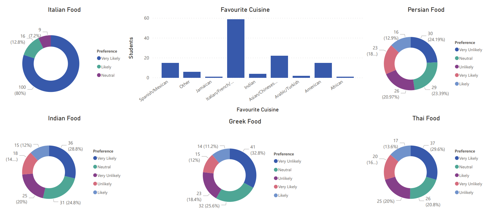
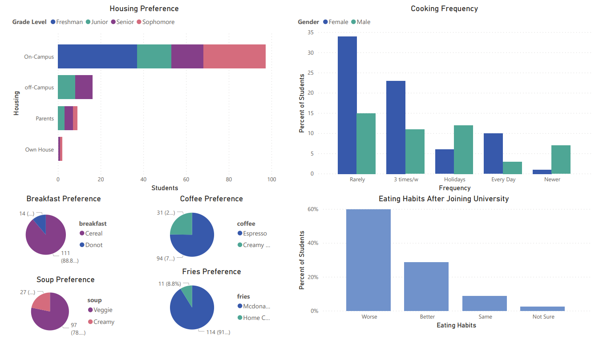
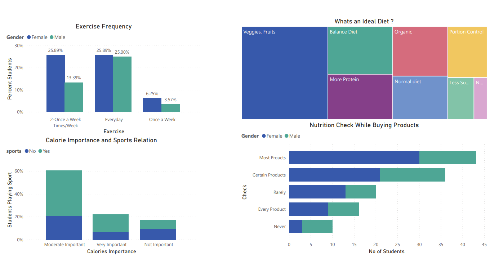

# Food-Choices

## Introduction
Food choices and preferences of college students
This dataset includes information on food choices, nutrition, preferences, childhood favorites, and other information from college students. There are 126 responses from students. Data is raw and uncleaned. Cleaning is in the process and as soon as that is done, additional versions of the data will be posted.
Acknowledgements

Kaggle Link: https://www.kaggle.com/borapajo/food-choices

## Dashboards

